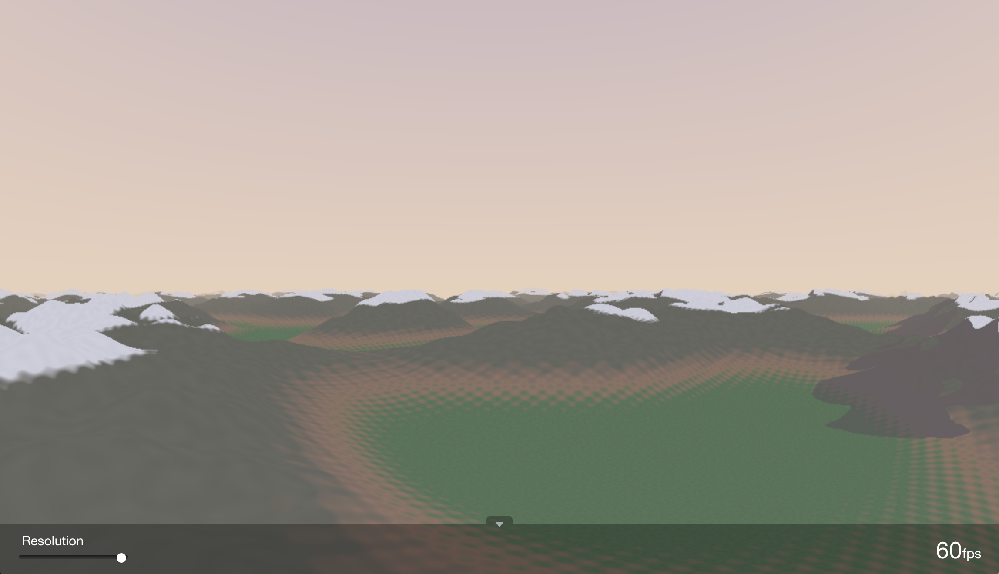

rayworld
========

A WebGL animation of flying over infinite procedurally-generated hills.

At the bottom of the screen is a small tray that can been shown or hidden, displaying
current FPS, as well as a slider to render at lower resolutions (useful for less
powerful computers). If the animation remains very slow, the resolution should reduce
automatically to make it somewhat useable. Shrinking the window a bit will also
improve FPS without decreasing pixel density.

How It Works
------------
The animation is rendered using ray-marching on the GPU.

Aside from a little WebGL boilerplate code, all of the work is done in a single
GLSL fragment shader. Two triangles are rendered to fill the entire viewport,
and the shader uses them as a canvas to render the world each frame.

Each frame, a ray is marched from each pixel of the canvas into the world, until
it hits terrain, or reaches a maximum distance. When a ray hits terrain, its
corresponding pixel is colored based on the terrain's coordinates, ambient light
and direct light from the sun if it is not shadowed by other terrain. Shadows
are calculated by marching another ray from the surface of the terrain towards
the sun, casting shadows if terrain is hit in the process.

The shape of the terrain is generated using simplex noise, provided by the code at
github.com/ashima/webgl-noise (see LICENSE.txt). To calculate the terrain height at
a given point, the noise function is sampled multiple times at different resolutions,
and the results are summed together to create large, rolling hills with some smaller
bumps and details.

Color is selected based exclusively on terrain height except in border regions,
where location on the plane is compared with a two dimensional sin function in order
to create a rough, cartoonish border effect.

This rendering technique is interesting, since it has infinite detail, (no matter
how far you zoom in, you won't see polygon edges) but it is quite slow. In fact,
the only reason its possible to render a scene anywhere near this complex is due
to the GPU's ability to calculate many pixels simultaneously. At each step of
the ray marching, the height of the terrain at that point must be sampled, causing
multiple calls to the simplex noise functions. At times of day when shadows are
particularly long, the slowdown is especially apparent.
